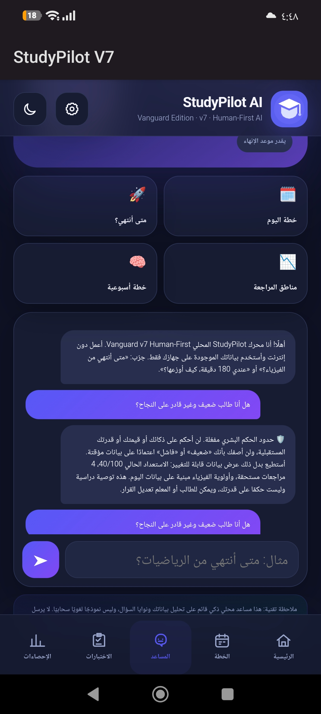
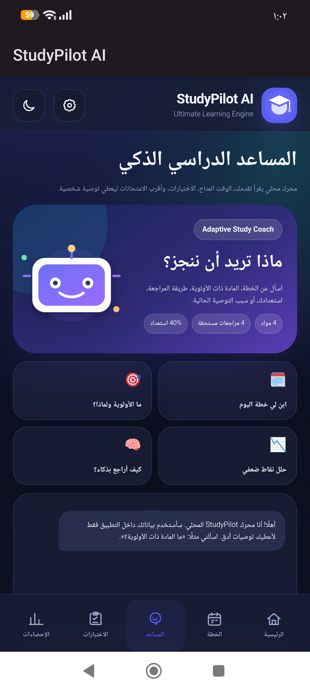
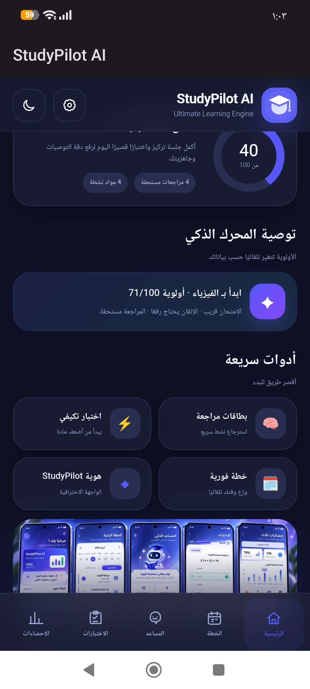
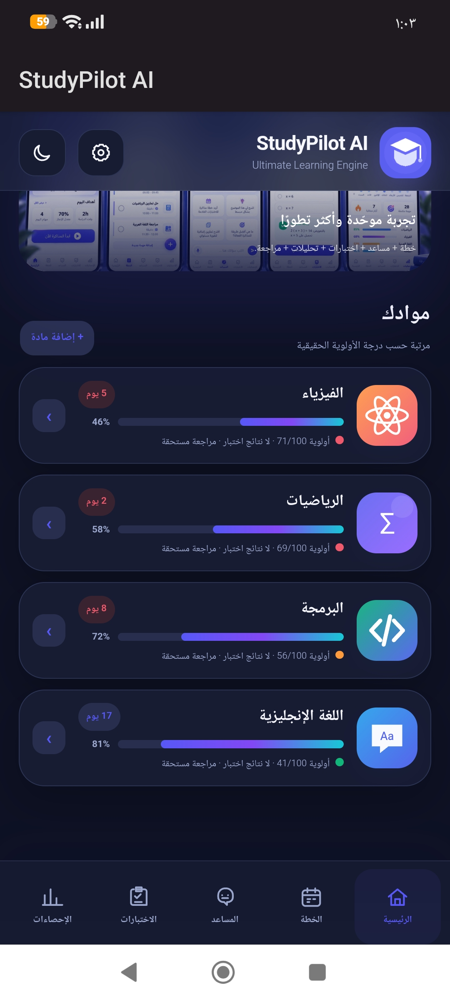

# StudyPilot AI
## 🏆 Vanguard Open 2026 — Human-First Edition

**StudyPilot AI V7** is a substantially developed version of my earlier StudyPilot project, created specifically for **The Vanguard Open 2026**.

The central addition is the **Human Judgment Boundary** — a human-first AI safety layer that defines what educational decisions AI may assist with and what decisions must remain human.

### 🛡️ Human Judgment Boundary

StudyPilot AI may:

- Prioritize subjects and study tasks
- Recommend how to distribute study time
- Analyze current progress and revision needs
- Suggest flexible study actions

But it refuses to:

- Judge a student's intelligence or personal worth
- Label a student as “weak,” “incapable,” or “a failure”
- Predict a student's future potential as a final judgment
- Make high-impact educational decisions that should remain with the student or teacher

Instead of making permanent judgments, the system returns changeable, evidence-based study data and makes clear that its output is a recommendation — not a judgment of human ability.

### 🔬 Demonstration

The screenshot below shows the Human Judgment Boundary responding to a protected question:

### 📦 Vanguard V7 Files

- [Download StudyPilot AI V7 — Human-First APK](./StudyPilotAI_v7_Vanguard_HumanFirst.apk)
- [Download StudyPilot AI V7 Web Source](./StudyPilotAI_v7_Vanguard_WebSource.zip)

> **Project history:** StudyPilot AI existed before The Vanguard Open. For the 2026 competition, I substantially developed the project by creating the Human Judgment Boundary, redesigning the assistant around human-first AI principles, and implementing a working demonstration of protected educational decisions.
**AI-Powered Adaptive Study Planning & Learning Assistant**

StudyPilot AI is an independently developed educational application designed to help students organize their studies, identify academic priorities, and receive personalized study recommendations.

I developed this project before beginning university as part of my self-directed journey in programming and artificial intelligence.

## 🎯 Purpose

Many students struggle with limited study time, multiple subjects, upcoming examinations, and uncertainty about what they should study first.

StudyPilot AI was created to turn these challenges into a clear and structured study process.

## ✨ Main Features

- Intelligent subject-priority recommendations
- Personalized study planning
- Academic progress tracking
- Adaptive study recommendations
- Practice tests and review tools
- Study-performance statistics
- Smart study assistant
- Automatic identification of weak subjects
- Local/offline-focused study support
- Modern Arabic user interface

## 🧠 Smart Study Engine

The application analyzes information such as:

- Subject progress
- Exam proximity
- Review requirements
- Current preparation level
- Academic priorities

It then recommends which subject the student should focus on and helps create a more effective study strategy.

## 💡 Why I Built It

I prepared for my Syrian scientific secondary-school examinations primarily through independent study at home.

That experience taught me how difficult it can be for a student to manage time, priorities, and academic pressure without continuous educational support.

This inspired me to build technology that can help students study more intelligently and independently.

## 🛠 Development

StudyPilot AI was independently designed and developed by:

**MUSTAFA ALHAJ AMIN**

The project allowed me to develop practical experience in:

- Python programming
- Application development
- User-interface design
- Problem solving
- Study-planning algorithms
- Data-driven recommendations
- Software testing and iterative improvement
## 📱 Application Screenshots

### Study Dashboard

### Smart Priority Engine

### AI Study Assistant

## 🚀 Future Development

My long-term goal is to develop StudyPilot AI further using Artificial Intelligence and Machine Learning.

Future versions may include:

- More advanced adaptive-learning models
- Personalized learning analytics
- Intelligent revision scheduling
- Performance prediction
- Enhanced offline AI assistance
- Multilingual educational support

## 🎓 Academic Goal

I aim to pursue a Bachelor's degree in **Computer Science**, with a long-term specialization in **Artificial Intelligence and Machine Learning**.

This project represents one of my first steps toward that goal.

---

**Developer:** MUSTAFA ALHAJ AMIN  
**Field of Interest:** Computer Science & Artificial Intelligence
